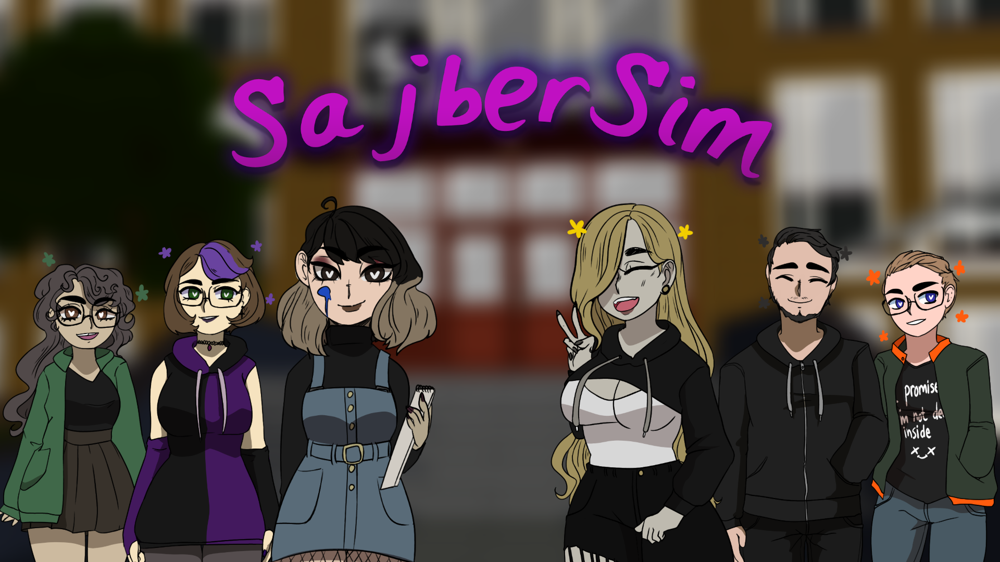

## Info

SajberSim är ett ramverk för visual novels med nuvarande mål för Öppna hus / marknadsföring för [Cybergymnasiet Odenplan](https://cybergymnasiet.se/), förväntas bli klart hösten 2020. 


## Nerladdning

Färdiga builds finns [här](https://github.com/LiterallyFabian/SajberSim/releases) eller på huvudsidan [Sajber.me](http://sajber.me), notera att dessa i nuläget inte direkt har något intressant att se.

För källkod kan du klona projektet med Git, och sedan öppna mappen i Unity.

```
git clone https://github.com/LiterallyFabian/SajberSim
cd SajberSim
```


## Kontakt / frågor / whatever

**Email:** fabian.lindgren@elev.cybergymnasiet.se 

**Discord:** Fabian#1540


## To-do

https://github.com/LiterallyFabian/SajberSim/projects/1

